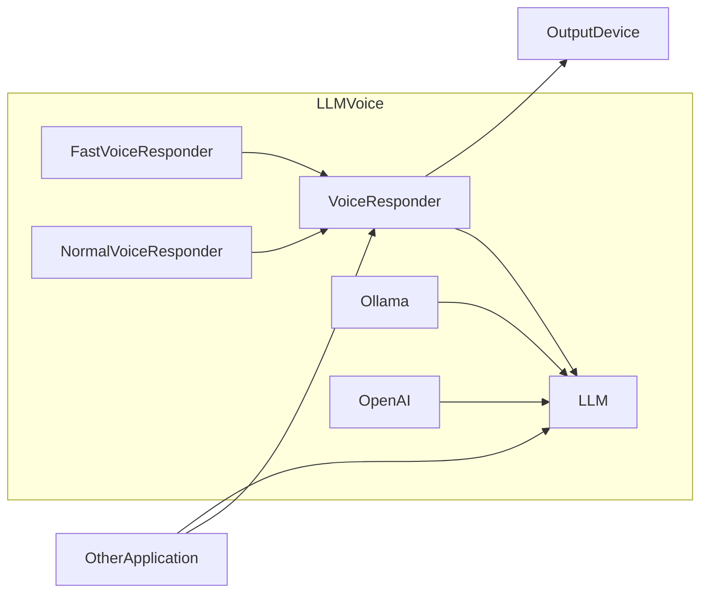

# LLM Voice

Library to reduce latency in voice generations from LLM chat completion streams.

## Installation

### From PyPI

```bash
pip install llm-voice
```

### From Source

```bash
pip install poetry
poetry install
```

## Design


